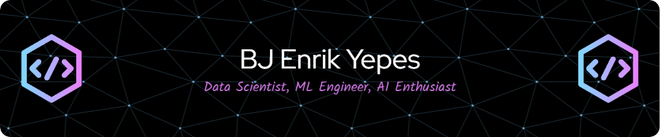

<h1 align="center">Hi 👋, I'm BJ Enrik Yepes</h1>
<h3 align="center">I am a Senior Data Scientist with a Master's degree in Data Science from the esteemed Asian Institute of Management. My expertise spans a wide spectrum within the Data Science and AI field, encompassing Generative AI, Machine Learning, Data Mining, Time Series Analysis, Natural Language Processing, Deep Learning, Reinforcement Learning, Network Science, and Image Processing.</h3>

  

- 🌱 I’m currently learning **Deep Learning, MLOps, and Timeseries Analysis**

- 👨‍💻 All of my projects are available at my github repository <a href="https://github.com/BJEnrik?tab=repositories">BJEnrik</a>

- 📝 I regularly write articles on Medium: <a href="https://medium.com/@bj.yepes">@bj.yepes</a>

- 💬 Ask me about **Data Science and AI**

- 📫 How to reach me **bj.yepes@gmail.com**

- 📄 Know about my experiences on LinkedIn <a href="https://www.linkedin.com/in/bj-enrik-yepes/">bj-enrik-yepes</a>

- ⚡ Fun fact **I am also an Aeronautical Engineer ✈️**

### Blogs posts
<!-- BLOG-POST-LIST:START -->
<!-- BLOG-POST-LIST:END -->

<h3 align="left">Connect with me:</h3>

<h3 align="left">Languages and Tools:</h3>

              

&nbsp;

